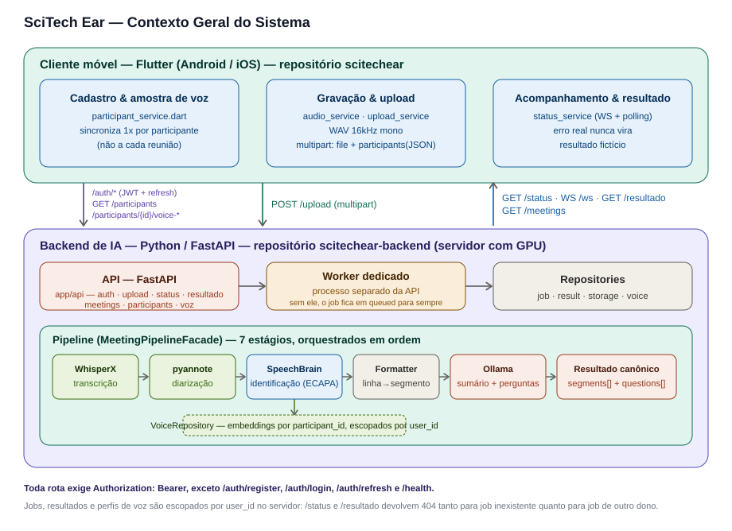
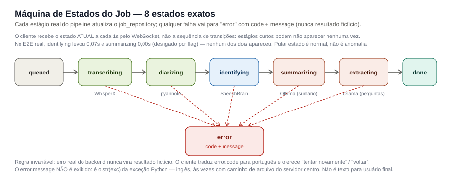
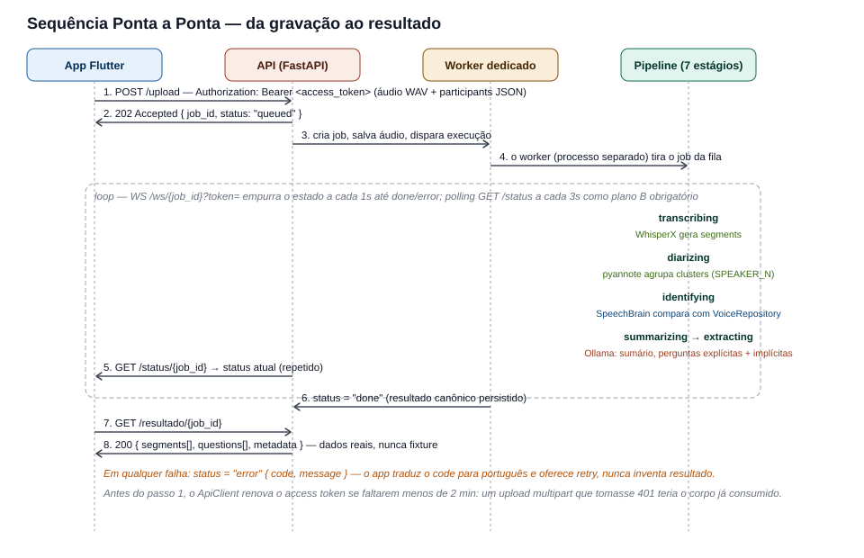
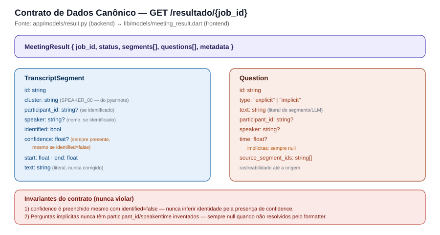

# SciTech Ear — Arquitetura Geral

> Este documento descreve a arquitetura do sistema como um todo — cliente
> Flutter + backend de IA. É mantido **idêntico nos dois repositórios**
> (`scitechear` e `scitechear-backend`) para que qualquer pessoa consiga
> entender o sistema completo a partir de qualquer um dos dois lados, sem
> precisar abrir o outro repositório primeiro. Detalhes específicos de cada
> lado estão em `docs/BACKEND_ARCHITECTURE.md` e
> `docs/FRONTEND_ARCHITECTURE.md`.
>
> Se esta é sua primeira leitura, o caminho recomendado é: (1) esta seção de
> introdução, (2) o glossário, (3) o diagrama de contexto geral, (4) a
> sequência ponta a ponta. Isso já dá uma visão de 80% do sistema antes de
> entrar nos detalhes de cada camada.

## 1. Por que este sistema existe

Reuniões geram conhecimento, mas esse conhecimento se perde com facilidade:
ninguém anota tudo, decisões ficam implícitas na conversa, e perguntas
importantes levantadas ao longo da discussão raramente são revisitadas
depois. O SciTech Ear existe para resolver um problema específico e
delimitado: **transformar o áudio de uma reunião em texto identificado por
pessoa, e extrair dali as perguntas que foram discutidas** — tanto as que
foram literalmente formuladas ("qual é o prazo?") quanto as que ficaram
implícitas na conversa, mas nunca foram ditas como pergunta.

O sistema não tenta ser um assistente de reuniões completo (não sugere
tarefas, não integra calendário, não gera atas automáticas prontas para
enviar). O escopo da primeira versão (V1) é deliberadamente restrito: captar
áudio, transcrever, identificar quem falou, e extrair perguntas. Esse
escopo restrito é uma decisão consciente — melhor um pipeline confiável e
bem testado em um problema específico do que um sistema amplo e frágil.

## 2. Os dois repositórios

| Repositório | Conteúdo | Tecnologia | Onde roda |
|---|---|---|---|
| `scitechear` | Aplicativo cliente | Flutter / Dart | No aparelho do usuário (Android na V1) |
| `scitechear-backend` | API + pipeline de IA | Python / FastAPI | Em um servidor com GPU |

Eles se comunicam exclusivamente por HTTP/WebSocket, através de um contrato
de dados bem definido (seção 6). Isso significa que, em teoria, qualquer um
dos dois lados poderia ser reescrito em outra tecnologia sem afetar o outro,
desde que o contrato seja respeitado — essa é uma das vantagens de manter a
fronteira entre eles estritamente pela API, sem atalhos.

## 3. Glossário — termos usados ao longo deste documento

Quem chega sem contexto prévio geralmente tropeça nestes termos. Vale ler
antes de seguir:

| Termo | Significado |
|---|---|
| **Job** | Uma execução do pipeline sobre uma reunião específica. Cada upload de áudio cria um job novo, identificado por um `job_id` (UUID). |
| **Pipeline** | A sequência de 7 etapas que transforma áudio bruto em resultado final (transcrição, diarização, identificação, sumarização, extração de perguntas). |
| **Diarização** | O processo de separar um áudio em "quem falou quando", sem necessariamente saber o *nome* de quem falou — só que existem, por exemplo, três vozes diferentes, rotuladas `SPEAKER_00`, `SPEAKER_01`, `SPEAKER_02`. |
| **Cluster** | O rótulo genérico (`SPEAKER_00`) que a diarização atribui a uma voz, antes de qualquer tentativa de descobrir *quem* é essa pessoa. |
| **Identificação (biometria de voz)** | O processo separado que tenta associar um cluster a uma pessoa real (`participant_id`), comparando a voz com amostras cadastradas previamente. Diarização e identificação são etapas e responsabilidades **diferentes** — ver seção 7. |
| **Embedding de voz** | Uma representação numérica (vetor) do timbre de uma voz, extraída por um modelo de IA. Vozes parecidas produzem vetores próximos entre si; é essa proximidade que permite comparar e identificar. |
| **participant_id** | O identificador estável de uma pessoa, definido no aplicativo e usado como chave em todo o sistema — nunca o nome. Ver seção 8. |
| **Enrollment (cadastro de voz)** | O ato de gravar uma amostra de voz de um participante e associá-la ao seu `participant_id`, para uso futuro na identificação. Acontece uma vez, não a cada reunião. |
| **LLM** | Modelo de linguagem de grande porte (Large Language Model) — aqui, executado localmente via Ollama, usado para sumarizar a reunião e extrair perguntas. |
| **Prompt** | O texto de instrução dado ao LLM, cuidadosamente desenhado e versionado, definindo exatamente o que se espera que o modelo produza. |
| **RAG** | Retrieval-Augmented Generation — uma técnica de dar contexto adicional a um LLM buscando informação relevante antes de gerar a resposta. **Está fora do escopo desta V1** (mencionado aqui só porque aparece em versões anteriores da documentação e pode gerar confusão). |
| **Cliente fino** | O princípio de que o aplicativo não processa nada de IA — só grava, envia, e exibe o que o backend devolve. |

## 4. Contexto geral do sistema



Em linhas gerais, o ciclo de vida de uma reunião processada é:

1. **Antes da reunião** (uma vez por participante, não repetido a cada
   encontro): cada pessoa que vai participar grava uma pequena amostra da
   própria voz no aplicativo. O app envia essa amostra ao backend, que
   extrai um embedding e o guarda associado ao `participant_id` dessa
   pessoa.
2. **Durante a reunião**: o aplicativo grava o áudio localmente, em formato
   WAV, 16kHz, mono — exatamente o formato que os modelos de IA usados no
   backend esperam, para evitar conversões desnecessárias.
3. **Ao final da gravação**: o app envia o áudio ao backend via
   `POST /upload`, junto com a lista de participantes daquela reunião (seus
   `participant_id`s e nomes). O backend responde imediatamente — em
   milissegundos — com um `job_id`, sem esperar o processamento terminar.
4. **Em segundo plano no servidor**: o backend processa o áudio através do
   pipeline de 7 etapas, atualizando o estado do job a cada estágio
   concluído.
5. **No aplicativo, enquanto isso**: a tela de processamento acompanha o
   estado do job (por WebSocket, com um mecanismo de repescagem por
   consulta periódica como plano B) e mostra ao usuário em que etapa o
   processamento está.
6. **Ao final**: o app busca o resultado completo — a transcrição segmento
   por segmento, com identificação de quem falou quando possível, e a lista
   de perguntas extraídas.

## 5. Máquina de estados do job



Um job percorre exatamente estes 8 estados possíveis, nesta ordem quando
tudo corre bem:

```
queued → transcribing → diarizing → identifying → summarizing → extracting → done
```

- **`queued`** — o job foi criado e aceito, mas o processamento ainda não
  começou.
- **`transcribing`** — o WhisperX está convertendo o áudio em texto.
- **`diarizing`** — o pyannote está identificando quantas vozes distintas
  existem no áudio e quando cada uma fala.
- **`identifying`** — o SpeechBrain está comparando cada voz encontrada com
  os embeddings cadastrados, tentando associar um `participant_id` a cada
  cluster.
- **`summarizing`** — o modelo de linguagem está gerando um resumo
  estruturado da reunião (usado como contexto para a etapa seguinte).
- **`extracting`** — o modelo de linguagem está extraindo as perguntas
  explícitas (literalmente formuladas) e implícitas (inferidas a partir do
  conteúdo).
- **`done`** — o resultado final foi persistido e está disponível para
  consulta.

Se qualquer etapa falhar — um modelo não carrega, o serviço de LLM está
fora do ar, o áudio está corrompido — o job vai para o estado **`error`**,
carregando um código (`code`) e uma mensagem (`message`) que descrevem a
causa. **Este é um ponto de design deliberado e não-negociável do
projeto:** o cliente nunca converte um erro real em um resultado inventado.
Quando algo falha de verdade, o usuário vê que falhou, com a opção de
tentar novamente ou voltar — não uma transcrição fictícia disfarçada de
sucesso. A única exceção é um modo de demonstração explicitamente ativado
por uma flag de compilação (`SCITECH_DEMO_MODE`), pensado para
apresentações sem depender de um backend ativo, nunca acionado
automaticamente como reação a uma falha.

## 6. Sequência ponta a ponta



Detalhando um pouco mais o que acontece tecnicamente em cada passo:

1. O app monta uma requisição `multipart/form-data` com o arquivo de áudio
   e um campo `participants` contendo um JSON com a lista de participantes
   (`[{"id": "...", "name": "..."}]`).
2. O backend valida a requisição (extensão do arquivo, formato do JSON de
   participantes), gera um `job_id` novo (um UUID aleatório — não há
   contador nem qualquer forma de reaproveitamento entre jobs), salva o
   áudio em disco associado a esse ID, e devolve `202 Accepted` com o
   `job_id` e status `queued`.
3. Um executor de jobs (`job_executor.py`) dispara o processamento em uma
   thread separada, para não bloquear a resposta HTTP nem outras
   requisições que cheguem enquanto esse job roda.
4. O orquestrador do pipeline (`pipeline_facade.py`) chama, em sequência
   estrita, cada um dos serviços responsáveis por uma etapa, atualizando o
   estado do job no repositório de jobs a cada transição.
5. Enquanto isso, o app consulta `GET /status/{job_id}` periodicamente (ou
   recebe atualizações por WebSocket, quando disponível) para saber em que
   ponto o processamento está.
6. Quando o status chega a `done`, o app faz uma última chamada,
   `GET /resultado/{job_id}`, e recebe o objeto completo com a transcrição
   e as perguntas.

## 7. Por que diarização e identificação são etapas separadas

Esta é uma das decisões de arquitetura mais importantes do projeto, e vale
explicar o raciocínio por trás dela, porque não é óbvio à primeira vista.

Poderia-se imaginar um único passo que "descobre quem falou o quê"
diretamente. Mas isso mistura dois problemas de natureza muito diferente:

- **Diarização** é um problema de *agrupamento*: dado um áudio, quantas
  vozes diferentes existem, e quando cada uma fala? O modelo (pyannote) não
  precisa saber, e não sabe, quem são essas pessoas — só que a voz A é
  diferente da voz B.
- **Identificação** é um problema de *comparação contra um banco de
  referência*: dado um trecho de voz já isolado, ele se parece o
  suficiente com alguma amostra previamente cadastrada para ser
  considerado a mesma pessoa?

Separar essas duas responsabilidades traz uma consequência prática
importante: **o sistema pode processar uma reunião com sucesso mesmo que
nem todos os participantes tenham cadastrado a voz**. Quem não tem amostra
cadastrada aparece no resultado com o rótulo genérico do cluster
(`SPEAKER_00`), em vez de o processamento inteiro falhar ou inventar um
nome. A transcrição e as perguntas continuam sendo produzidas normalmente;
só a identificação nominal daquela pessoa específica fica em aberto.

Essa separação também é o motivo de existir um estado `identifying`
distinto de `diarizing` na máquina de estados — são de fato etapas
diferentes, com modelos diferentes (pyannote para uma, SpeechBrain para a
outra), e podem falhar por razões diferentes.

## 8. Por que `participant_id` e não o nome

Nomes têm um problema estrutural para uso como identificador: não são
únicos (duas pessoas podem se chamar "Ana"), podem mudar (alguém pode ser
recadastrado ou renomeado), e não são estáveis o suficiente para servir de
chave entre dois sistemas diferentes que precisam concordar sobre "quem é
quem". Por isso, o `participant_id` (gerado pelo aplicativo no momento em
que a pessoa é cadastrada) é a chave real usada em toda comunicação entre
o app e o backend. O nome é armazenado e exibido, mas nunca usado
estruturalmente — não é chave de nenhum dicionário, não é usado para
localizar arquivos em disco, não é comparado para decidir se duas pessoas
são a mesma.

Isso também explica uma migração que o próprio backend precisou fazer: o
protótipo original (nos scripts em `legacy/`) usava o nome da pessoa como
chave de pasta no sistema de arquivos. A versão integrada corrigiu isso,
adotando `participant_id` desde o início, com um utilitário de migração
não-destrutivo para trazer dados antigos (se existirem) para o novo
formato.

## 9. Contrato de dados canônico



O resultado de uma reunião processada com sucesso tem sempre esta forma:

```json
{
  "job_id": "…",
  "status": "done",
  "segments": [
    {
      "id": "seg_0001",
      "cluster": "SPEAKER_00",
      "participant_id": "p1",
      "speaker": "Leandro",
      "identified": true,
      "confidence": 0.836,
      "start": 0.0,
      "end": 4.2,
      "text": "Bom dia a todos."
    }
  ],
  "questions": [
    {
      "id": "P1",
      "type": "explicit",
      "text": "Qual é o prazo final para entregar a integração completa?",
      "participant_id": "p1",
      "speaker": "Leandro",
      "time": 12.5,
      "source_segment_ids": ["seg_0004"]
    }
  ],
  "metadata": { "whisperx_model": "turbo", "voice_model": "…", "…": "…" }
}
```

Cada segmento de transcrição carrega tanto o `cluster` (o rótulo bruto da
diarização) quanto, quando disponível, o `participant_id` e o `speaker`
(nome) resolvidos pela identificação. Isso permite ao cliente exibir
sempre a melhor informação disponível: o nome da pessoa quando
identificada, ou o rótulo genérico quando não.

**Duas invariantes que o sistema nunca viola, e que vale conhecer para não
reintroduzi-las por engano em uma manutenção futura:**

1. **`confidence` é preenchido mesmo quando `identified: false`.** Ou seja,
   mesmo que a identificação tenha sido rejeitada (por não atingir o
   limiar mínimo de confiança, ou por estar ambígua demais entre dois
   candidatos), o melhor score calculado ainda é exposto no resultado. O
   campo que de fato decide se alguém foi identificado é sempre
   `identified` — nunca a mera presença de um valor em `confidence`. Essa
   escolha existe para permitir calibrar os limiares de identificação no
   futuro observando dados reais de rejeição, em vez de descartar essa
   informação.
2. **Perguntas implícitas nunca têm identidade inventada.** Uma pergunta
   implícita (inferida pelo modelo de linguagem a partir do conteúdo da
   reunião, não literalmente formulada por ninguém) nunca recebe um
   `participant_id`, `speaker` ou `time` fabricado — esses campos ficam
   `null` quando não há como atribuir a pergunta a um momento e uma pessoa
   específicos com segurança.

## 10. Filosofia de tratamento de erro

Um princípio atravessa tanto o backend quanto o app, e vale destacá-lo
separadamente por sua importância: **um erro real nunca é escondido atrás
de um resultado fabricado.** Isso parece óbvio dito assim, mas é uma
armadilha comum em protótipos — é tentador, quando algo falha durante o
desenvolvimento, mostrar "algo" na tela em vez de um erro, para a
demonstração parecer funcionar. O SciTech Ear deliberadamente evita esse
caminho: se o backend não está acessível, se um modelo falha, se o upload
é rejeitado, o aplicativo mostra isso claramente ao usuário, com a opção
de tentar de novo. O único cenário em que dados fabricados aparecem é um
modo de demonstração explícito, ativado deliberadamente na compilação do
app (não em runtime, para evitar ficar "esquecido ligado").

## 11. Decisões de arquitetura que atravessam os dois repositórios

- **Cliente fino.** Nenhum modelo de IA roda no dispositivo; a API é a
  única fronteira entre app e backend. Isso mantém o aplicativo leve e
  funcional em aparelhos modestos, e centraliza o uso da GPU no servidor.
- **Identidade é sempre resolvida pelo backend**, nunca inferida pelo
  cliente por posição de lista ou qualquer outra heurística local.
- **`participant_id` é a chave compartilhada**, não o nome (seção 8).
- **Erro real nunca vira resultado fictício**, em nenhum dos dois lados
  (seção 10).
- **Sem dependência de nuvem no caminho de execução do backend.**
  Notebooks e scripts que usam Google Colab/Google Drive ficam isolados
  como referência histórica em `legacy/`; o runtime de produção é Python
  convencional, pensado para ser portável para um servidor Linux com GPU,
  sem acoplamento a nenhum provedor específico.
- **RAG está fora do escopo desta V1.** A extração de perguntas usa o
  conteúdo da própria transcrição e do resumo gerado, sem um passo de
  recuperação de documentos externos.

## 12. Documentos relacionados

- [`docs/BACKEND_ARCHITECTURE.md`](./BACKEND_ARCHITECTURE.md) — detalhamento
  completo do backend: cada serviço, cada camada, o legado, os prompts.
- [`docs/FRONTEND_ARCHITECTURE.md`](./FRONTEND_ARCHITECTURE.md) —
  detalhamento completo do app: cada tela, cada serviço, os modelos de
  dados.
- `SciTech_Ear_Especificacao_Final_Implementacao_Claude.docx` — a
  especificação de implementação original, usada como fonte de verdade
  durante o desenvolvimento da V1. Este documento de arquitetura é a
  versão consolidada e atualizada, refletindo o estado real do código.
