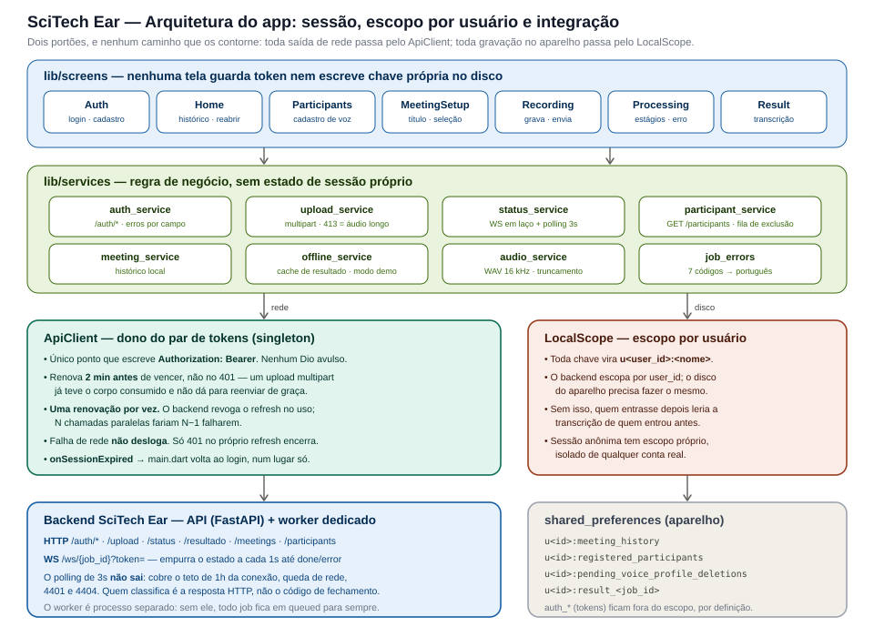

# SciTech Ear — Arquitetura do Frontend

> Complementa o [`docs/ARCHITECTURE.md`](./ARCHITECTURE.md) (visão geral do
> sistema, com glossário — leia-o primeiro se ainda não leu). Este documento
> detalha o repositório `scitechear`: cada tela, cada serviço, e o
> raciocínio por trás das decisões que moldaram essa estrutura.

## 1. O papel do aplicativo: cliente fino

Antes de entrar nos detalhes de cada arquivo, vale fixar o princípio que
organiza todo o resto: **este aplicativo não processa inteligência
artificial nenhuma.** Ele grava áudio, envia ao backend, acompanha o
progresso, e exibe o que recebe de volta. Nenhuma transcrição, nenhuma
identificação de voz, nenhuma extração de pergunta acontece no aparelho.
Essa escolha existe por dois motivos: manter o aplicativo leve o
suficiente para rodar em qualquer telefone comum, e concentrar o uso da
GPU (recurso caro e escasso) inteiramente no servidor.

Uma consequência direta disso é que a maior parte do código do app não
está resolvendo problemas de IA — está resolvendo problemas de engenharia
de aplicativo móvel: gravar áudio de forma confiável mesmo com a tela
bloqueada, lidar com conexão instável, e apresentar de forma clara um
processamento que pode levar minutos.

## 2. Visão geral


O código está organizado em três camadas dentro de `lib/`: **telas**
(`screens/`, a interface e o fluxo de navegação), **serviços**
(`services/`, a lógica de integração com o backend e com recursos do
aparelho), e **modelos** (`models/`, as estruturas de dados que espelham o
contrato do backend). Diferente do backend, aqui não há uma camada de
"repositório" formal — o estado local relevante (cache de resultados,
sessão do usuário) é gerenciado dentro dos próprios serviços.

### Os dois portões

Sobre essas três camadas há uma quarta ideia, que é o que sustenta a
integração com um backend autenticado e multiusuário: **dois portões, e
nenhum caminho que os contorne.**



**`ApiClient` é o único que fala `Authorization`.** Nenhuma tela guarda
token, nenhum serviço cria um `Dio` avulso. Uma segunda cópia do token
dessincronizaria na primeira renovação, e o app passaria a alternar entre
chamadas válidas e 401 conforme quem tivesse falado primeiro com o servidor.

**`LocalScope` é o único que decide onde uma chave é gravada.** Toda chave
de `shared_preferences` vira `u<user_id>:<nome>`. O backend escopa por
`user_id`; o disco do aparelho precisa fazer o mesmo, senão quem entrar
depois lê a transcrição de quem entrou antes — passando por baixo do escopo
do servidor, já que o cache local abre resultados sem consultá-lo.

As duas regras estão no README, na lista do que não fazer, porque violá-las
não quebra nada imediatamente: quebra na segunda conta, ou na primeira
renovação concorrente.

## 3. Fluxo de telas

O aplicativo segue um fluxo linear, tela após tela, sem um framework de
gerenciamento de estado global (como Provider, Riverpod ou Bloc) — as
dependências (como o serviço de autenticação) são passadas explicitamente
de uma tela para a seguinte, através dos construtores dos widgets. Essa é
uma escolha deliberadamente simples: para o tamanho atual do aplicativo,
introduzir uma camada de gerenciamento de estado traria mais complexidade
do que benefício. Se o app crescer substancialmente, essa é uma decisão
que vale revisitar.

### 3.1. `AuthScreen` — entrada

Login e cadastro contra o `/auth` do backend. Até a integração da
autenticação real, era um mock local que aceitava qualquer credencial e
tinha uma conta fixa embutida — o que deixou de funcionar quando o backend
passou a exigir JWT em todas as rotas.

Duas restrições da tela vêm diretamente do contrato do servidor, e é por
isso que elas são validadas aqui em vez de simplesmente deixar o erro
voltar: o campo de identificação é **só e-mail** (o backend tipa como
`EmailStr`; um nome de usuário voltaria 422 antes de qualquer verificação
de credencial), e a senha tem **mínimo de 8 caracteres no cadastro**
(`Field(min_length=8)`). No login não se valida o tamanho — quem tenha uma
senha mais curta de antes precisa conseguir entrar, e o veredito é do
servidor.

### 3.2. `HomeScreen` — ponto de partida

Mostra o histórico de reuniões já realizadas e é o ponto de partida para
iniciar uma nova. Também é responsável por reabrir uma reunião já
processada anteriormente (buscando o resultado em cache local ou,
se necessário, consultando o backend de novo). Esta tela segue a mesma
regra de tratamento de erro das telas de gravação e processamento
(seção 6): se não conseguir carregar uma reunião do histórico, mostra um
erro real, nunca inventa um conteúdo.

### 3.3. `MeetingSetupScreen` — antes de gravar

Onde o título da reunião é definido e os participantes são selecionados
ou cadastrados (em `ParticipantsScreen`). Ter participantes na lista, ou
que algum deles tenha voz cadastrada, **não é obrigatório para iniciar a
gravação** — o botão "Iniciar Gravação" fica sempre habilitado. Essa é uma
decisão deliberada, não uma omissão: a identificação por voz já é opcional
por design do lado do backend (seção 7 de
[`docs/ARCHITECTURE.md`](./ARCHITECTURE.md#7-por-que-diarização-e-identificação-são-etapas-separadas)) —
quem não tem amostra cadastrada aparece no resultado com o rótulo genérico
do cluster, e o processamento continua normalmente. Exigir participantes
no cliente antes de deixar o usuário começar a gravar seria replicar, na
UI, uma restrição que o backend nunca teve.

É em `ParticipantsScreen`, através do bottom sheet `VoiceSampleSheet`, e
só ali, que uma amostra de voz é gravada e sincronizada com o backend —
nunca durante a gravação da reunião em si. A captura dura 20 segundos
(constante `_maxSeconds` em `voice_sample_sheet.dart` — única fonte de
verdade; o cronômetro e a barra de progresso são calculados a partir
dela, não duplicados). Durante a gravação, uma frase-guia fica visível na
tela para o usuário ler em voz alta — ajuda a capturar uma amostra mais
consistente do que pedir para a pessoa "falar algo" sem roteiro. O rótulo
da tela foi renomeado de "Cadastrar participante" para "Cadastro de
Biometria da Voz", para deixar explícito que aquele fluxo é sobre biometria
de voz do participante — distinto do cadastro de usuário do próprio app
(`AuthScreen`), que é outro conceito e não deve ser confundido com este.

### 3.4. `RecordingScreen` — durante a reunião

Grava o áudio (WAV, 16kHz, mono, o formato exato que o backend espera) e,
ao finalizar, envia ao servidor. Reflete o princípio da seção 6: se o
envio falhar, o erro real é mostrado, com a opção de tentar reenviar o
mesmo arquivo já gravado (sem precisar regravar a reunião do zero).

**Bug crítico encontrado e corrigido: truncamento silencioso de reuniões
longas.** Vale registrar em detalhe porque a causa é sutil e
pode reaparecer se `audio_service.dart` for mexido sem essa memória. O
sintoma: uma reunião gravada por minutos (testado com mais de 3 minutos,
em um tablet Samsung) resultava em um arquivo de áudio válido, mas com
apenas ~45 segundos de duração — sem nenhum erro visível no app, em
nenhum momento. A causa raiz está inteiramente no lado nativo do pacote
`record`, e o app nunca tinha visibilidade sobre ela:

- `AudioRecorder` (o wrapper do pacote `record`) expõe um
  `onStateChanged()` — um stream de estados (`record`/`pause`/`stop`) que
  também carrega, via `onError` da subscription, qualquer exceção lançada
  pelo gravador nativo. Nem `AudioService` nem `RecordingScreen` nunca
  escutaram esse stream — só o stream de amplitude (`onAmplitudeChanged`)
  era consumido.
- No Android, quando o `AudioRecord` nativo falha em ler o buffer de áudio
  (por exemplo, `AudioRecord.ERROR_DEAD_OBJECT` — um erro documentado,
  comum especificamente em aparelhos Samsung sob otimização agressiva de
  bateria/memória, onde o serviço de áudio do sistema é reiniciado), a
  thread de gravação nativa captura a exceção, finaliza o encoder
  normalmente e escreve um header WAV correto para os dados já
  capturados até aquele ponto. O resultado é um arquivo **válido e
  limpo**, só que **truncado** — não corrompido, não vazio, o que tornava
  o sintoma difícil de associar à causa sem investigar o pacote nativo.
- O erro é, de fato, propagado para o lado Dart (via
  `sendStateErrorEvent`) — mas cai no vazio, porque nada está inscrito em
  `onStateChanged()`. Minutos depois, quando o usuário toca em "parar",
  `_audio.stop()` simplesmente devolve o caminho do arquivo já finalizado,
  sem lançar exceção — do ponto de vista do Dart, tudo pareceu correr bem.

**A correção:** `RecordingScreen` agora escuta `stateStream` durante a
gravação e trata qualquer parada que não tenha partido do usuário
(`_handleUnexpectedStop`): para o cronômetro e a waveform, desliga o
serviço de segundo plano, recupera o arquivo parcial e mostra na hora um
aviso dizendo quanto tempo de fato foi gravado, com a escolha entre
descartar ou enviar o trecho que sobrou. Truncado é melhor do que
perdido — o backend processa normalmente o que receber —, mas quem
decide é o usuário, que é o único que sabe se vale analisar só o começo
da reunião.

Três detalhes do lado nativo que a implementação depende, confirmados em
`record_android` e que valem checar de novo se o pacote for atualizado:

- Em falha, `RecordThread` chama `onFailure(ex)` e, no `finally`,
  `onStop()`. O Dart recebe **os dois** — o erro pela `onError` da
  subscription e o `RecordState.stop` pelo stream. Por isso o tratamento
  tem um guard sincrônico (`_handlingInterruption`), senão rodaria duas
  vezes.
- Uma parada normal, pedida pelo usuário, também emite `RecordState.stop`.
  O que distingue as duas é que `_stopAndUpload` cancela a inscrição
  *antes* de chamar `stop()` — então um `stop` que chegue ao listener é,
  por construção, sempre inesperado.
- Depois da falha, `onStop()` zera o `recorderThread` nativo. A chamada
  seguinte a `stop()` cai no ramo em que a thread já não existe e apenas
  devolve o caminho configurado, sem lançar — é assim que o áudio parcial
  é recuperado. `_currentPath` (o retorno de `start()`) fica como rede de
  segurança para o caso de `stop()` devolver nulo.

Fica em aberto a alternativa mais ambiciosa: em vez de encerrar a
reunião, reiniciar o gravador e concatenar os trechos. Exigiria juntar
WAVs no dispositivo (descartar headers, emendar o PCM, reescrever o
header final) e ainda assim deixaria um buraco de áudio no ponto da
falha. Só vale o custo se a interrupção se mostrar frequente no uso real.

**Achado relacionado, esse já corrigido:** o áudio da reunião estava sendo
gravado em `getTemporaryDirectory()` (diretório de cache do Android,
sujeito a limpeza pelo sistema operacional a qualquer momento), diferente
da amostra de voz, que sempre usou `persistent: true`
(`getApplicationDocumentsDirectory()`). Corrigido para `persistent: true`
também na gravação da reunião — importa especialmente para reuniões
longas (1h+), que passam bem mais tempo em disco, aguardando a gravação
terminar e o upload completar, do que uma amostra de voz de 20 segundos.

### 3.5. `ProcessingScreen` — acompanhando o processamento

Mostra visualmente os seis estágios não-terminais do job
(`queued`, `transcribing`, `diarizing`, `identifying`, `summarizing`,
`extracting`), consultando o status do backend. O estado `error` não é
tratado como mais um passo da lista — vira uma tela de erro própria e
distinta, com título, mensagem específica (vinda do `error.message` do
backend, quando disponível) e as opções de tentar novamente ou voltar.
Um botão explícito de voltar para `HomeScreen` também está disponível
durante o acompanhamento ativo do processamento, não só na tela de erro —
antes, a única saída enquanto o job ainda estava rodando era o gesto de
voltar do sistema. Isso é seguro porque a reunião já é registrada no
histórico local logo no início do job (`queued`, em
`recording_screen.dart`, antes mesmo de navegar para esta tela) — sair
cedo não faz o usuário perder a reunião de vista.

### 3.6. `ResultScreen` — o resultado final

Exibe a transcrição, organizada por segmento e por falante, e as perguntas
extraídas (explícitas e implícitas), em abas. O texto de cada segmento e
de cada pergunta é exibido exatamente como veio do backend, sem
reprocessamento no cliente. O botão de voltar para `HomeScreen`, no
cabeçalho, ganhou um `tooltip` explícito ("Voltar às suas reuniões") — o
comportamento de navegação (limpar a pilha até a tela inicial) já estava
correto, o que faltava era deixar o propósito do ícone óbvio para quem
não reconhece o ícone de casa de cara.

### 3.7. Convenções de campos de texto

Campos de texto livre relevante — título da reunião (`MeetingSetupScreen`,
e o diálogo de renomear em `HomeScreen`) e nome de participante
(`ParticipantsScreen`, e "Nome completo" em `AuthScreen`) — usam
`textCapitalization`, ajustado por campo: `.sentences` para os campos de
título (só a primeira letra do texto maiúscula, já que um título é mais
frase do que uma sequência de palavras próprias) e `.words` para os campos
de nome de pessoa (cada parte do nome capitalizada). E-mail, senha e o
campo de e-mail de destinatário (`ResultScreen`, envio de perguntas) ficam
deliberadamente sem capitalização automática — não faz sentido para
credenciais nem para endereços de e-mail.

Acentuação e cedilha (relevantes porque o app é em português do Brasil)
nunca tiveram um `inputFormatter` bloqueando — não havia nenhum restringindo
caracteres em nenhum campo. Um teste (`test/text_encoding_test.dart`)
cobre o round-trip de nomes acentuados através de `jsonEncode`/`jsonDecode`
(persistência local via `SharedPreferences`) e do `FormData` do dio
(multipart enviado ao backend), como validação de que nenhuma das duas
camadas de codificação corrompe o texto.

## 4. Serviços — a lógica por trás das telas

### 4.0. `api_client.dart` e `auth_service.dart` — sessão

`ApiClient` é o dono do par de tokens e o único lugar do app que fala
`Authorization`. É singleton de propósito: o token é estado de processo, e
uma segunda cópia dessincronizaria na primeira renovação — o app passaria a
alternar entre chamadas válidas e 401 conforme qual serviço tivesse falado
primeiro com o backend. Quem precisa de HTTP autenticado pede
`ApiClient.instance.client()`, que devolve um `Dio` novo (os timeouts
variam muito: o upload espera minutos, o polling de status espera segundos)
já com o interceptor. O que se compartilha é o token, não a configuração de
rede.

Quatro decisões que valem registrar:

- **Renovar antes de vencer, não depois de falhar.** Antes de cada
  requisição, se o access token expira em menos de 2 minutos, ele é
  renovado. O reenvio após 401 existe como rede de segurança — token
  revogado no servidor, relógio do aparelho fora de hora —, não como
  caminho principal. Isso também evita o caso chato de reenviar um upload:
  o corpo multipart já foi consumido no primeiro envio, e só é recuperável
  via `FormData.clone()` (que o reenvio faz, mas é melhor não depender
  disso).
- **Uma renovação por vez.** Chamadas concorrentes com o token vencido
  compartilham o mesmo `/auth/refresh` (`_refreshInFlight`). O backend
  revoga o refresh token no momento em que ele é usado, então N renovações
  paralelas fariam N−1 falharem — e o usuário seria deslogado por estar
  usando o app em duas telas ao mesmo tempo.
- **Falha de rede não desloga.** Só um 401 no próprio refresh encerra a
  sessão. Timeout ou conexão caída preserva o token: perder a sessão a cada
  oscilação de Wi-Fi seria pior do que um erro passageiro.
- **Expiração tratada em um ponto só.** `ApiClient` emite
  `onSessionExpired`; `main.dart` escuta, avisa e leva de volta ao login.
  Sem isso, toda tela precisaria saber distinguir um 401 sobre a operação
  que ela pediu de um 401 que significa "a sessão acabou".

`AuthService` fica com o que é de autenticação e não de transporte: as
chamadas a `/auth/*`, o `AppUser` corrente e a tradução dos erros do
servidor para mensagens em português (401 credencial, 409 e-mail já
cadastrado, 429 com o `Retry-After`, 422 validação). Ele usa
`ApiClient.public` — um `Dio` sem interceptor — porque um 401 no login *é*
a resposta esperada, não um gatilho de renovação.

Dois detalhes do contrato que a implementação absorve:
`/auth/register` devolve o usuário criado, não um par de tokens, então o
cadastro faz o login logo em seguida (fazer o usuário digitar de novo o que
acabou de preencher seria repassar a ele um detalhe da API); e `/auth/logout`
precisa do refresh token no corpo para revogá-lo de fato — esquecer só
localmente deixaria o token válido por 30 dias.

### 4.0.1. `local_scope.dart` — isolamento dos dados no aparelho

Tudo que o app persiste localmente — histórico de reuniões, cadastro de
participantes e cache de transcrições — é escopado por usuário
(`u<userId>:<chave>`).

Isso virou obrigatório com a autenticação real, e por um motivo específico.
O `logout()` do login mock fazia `prefs.clear()`, apagando tudo; o novo
limpa só as chaves de sessão, o que é o comportamento certo (trocar de
conta e voltar preserva os dados de cada um) mas abriria um vazamento entre
contas enquanto as chaves fossem globais. O caso mais grave é o
`LocalResultCache`: ele abre resultados **sem consultar o backend**, então
quem entrasse depois no aparelho leria as transcrições de quem entrou
antes, passando por baixo do escopo que o servidor aplica. Histórico e
participantes (que carregam o caminho das amostras de voz, biometria de uma
pessoa) tinham o mesmo problema.

Duas decisões:

- **Escopo, não limpeza.** Apagar no logout também resolveria o vazamento,
  mas torraria o cadastro de participantes de quem só está saindo do app —
  era o efeito colateral do `prefs.clear()` antigo. Escopar espelha o
  modelo do backend, que já separa jobs e vozes por `user_id`.
- **Adoção dos dados legados.** Na atualização, as chaves globais existentes
  são movidas para o escopo do primeiro usuário que logar, e removidas.
  Sem isso, histórico e participantes sumiriam da tela — continuariam no
  disco, só que sob chaves que ninguém mais lê. O dono legítimo é
  indeterminável em retrospecto; o primeiro a logar é o palpite mais
  provável (o login era mock, de uso pessoal) e, de todo modo, melhor do que
  deixar os dados visíveis para todos.

Limitação conhecida: o escopo é das *chaves*, não dos arquivos. As amostras
de voz e os WAVs de reunião ficam no diretório de documentos do app, sem
separação por usuário. Não há caminho pela interface até eles (o cadastro
que os referencia é escopado) e o diretório é privado ao app, mas o
isolamento ali é mais fraco do que o das chaves.

`AppUser` espelha o `UserPublic` do backend e não tem mais nada: `user_id`,
`email` e `name`. Havia um `isAdmin` sobrando do login mock, sempre `false`,
com um selo de administrador na `HomeScreen` que nunca aparecia. O backend
confirmou em 07/09/2026 que não existe noção de papel em lugar nenhum do
servidor, e que avisa antes se um dia houver — o campo e o selo foram
removidos. Um campo inerte é pior do que campo nenhum: quem lê o modelo
supõe que exista uma regra de autorização em algum lugar.

### 4.1. `participant_service.dart` — identidade e voz

Gerencia os dados do participante no aparelho, sincroniza a amostra de voz
com o backend através de `POST /participants/{id}/voice-samples`, e trata o
servidor como fonte da verdade sobre quais perfis de voz existem — ver
"O `participant_id` e a reinstalação", mais abaixo nesta seção. Um
ponto de design que merece destaque, porque já foi fonte de um bug real
antes de ser corrigido: **a sincronização acontece uma única vez, no
momento do cadastro ou da atualização da amostra — nunca a cada
reunião.** Isso é garantido estruturalmente pelo próprio ponto de chamada:
a função de sincronização só é invocada a partir da tela de cadastro de
participantes, nunca do fluxo de upload de uma reunião.

#### O `participant_id` e a reinstalação

O `participant_id` é **gerado pelo app** (`microsecondsSinceEpoch`, no
cadastro) e o servidor guarda o perfil de voz em
`storage/voices/<user_id>/<participant_id>/`. As três rotas de
`/participants/{id}` exigem que o chamador já saiba o id — então **um id
esquecido é um perfil de voz invisível e inapagável**: ninguém consegue
listar para descobrir que existe, nem remover sem ele. É o dado mais
sensível que o sistema guarda, e o que menos deveria sobrar por acidente.

O cadastro local mora em `shared_preferences`, que não sobrevive a
desinstalar o app nem a trocar de aparelho. Sem mais nada, cada reinstalação
órfãria o conjunto inteiro de perfis daquela conta: o usuário recadastra as
mesmas pessoas, recebe ids novos, e os antigos ficam para sempre.

Duas defesas, e nenhuma é opcional:

**`GET /participants` semeia o cadastro de volta.** A rota devolve `id` e
`name` — o `display_name` que o app mandou junto da amostra. Com o nome
junto, a listagem deixa de ser uma vassoura e vira recuperação:
`seedFromServerIfEmpty()`, chamado pela `HomeScreen`, traz os participantes
com a voz já pronta quando o cadastro local está vazio. O órfão não é limpo
depois — ele não chega a existir.

**Um id nunca é descartado sem confirmação.** A remoção local sempre
acontece, com ou sem rede; mas quando o `DELETE .../voice-profile` falha, o
id vai para `u<user_id>:pending_voice_profile_deletions` e é retomado na
próxima abertura da tela. Antes, o id ia embora junto com o registro local e
o perfil ficava órfão — o usuário via um aviso, sem nada que pudesse fazer.

A ordem entre as duas importa e não é óbvia: a fila de exclusões é retomada
**antes** da listagem, e ids ainda pendentes são filtrados dela. Na ordem
inversa, quem apagasse um participante sem rede o veria voltar como cadastro
na abertura seguinte — o servidor ainda tem o perfil, e a listagem o traria.

Consequência na interface: um participante semeado tem perfil no servidor e
**nenhum WAV neste aparelho**. A pergunta que a tela faz é
`hasVoiceProfile` (`voiceProfileSynced || hasVoiceSample`), não
`hasVoiceSample` — esta responderia "não" para todo mundo depois de
reinstalar, mandando o usuário regravar voz que já está cadastrada.

### 4.2. `upload_service.dart` — enviando a reunião

Monta a requisição multipart para `POST /upload`: o arquivo de áudio, e a
lista de participantes serializada como um único campo JSON
(`participants`), com `id` e `name` de cada um. Uma versão anterior deste
serviço enviava uma amostra de voz por participante a cada upload de
reunião (`voice_samples[]`) — isso foi removido, já que o cadastro de voz
passou a ser responsabilidade exclusiva de `participant_service.dart`,
feito uma única vez. Erros de rede ou de resposta do servidor são
convertidos em uma exceção tipada (`UploadException`), com mensagens
específicas e acionáveis (timeout, sem conexão, erro retornado pelo
servidor), em vez de um erro genérico indiferenciado.

Uma correção relacionada: a mensagem de erro do servidor era lida de
`data['message']`, campo que o FastAPI não usa — ele devolve `detail`. Na
prática nenhum erro de servidor jamais chegava ao usuário, todos caíam no
texto genérico com o código HTTP.

### 4.3. `status_service.dart` — acompanhando o job

O WebSocket é o caminho **primário**; o polling de 3 segundos é o fallback.
Desde a Fase 8 do backend (validada em 05/09/2026), o `/ws` empurra o estado
atual **a cada segundo** até `done`/`error`, ou até o teto de 1 hora por
conexão. O cliente lê **em laço** — encerrar depois da primeira mensagem
descartaria o push e cairia no polling sem necessidade.

Duas propriedades que quem consome este stream precisa respeitar:

**O job não passa necessariamente pelos oito estados.** O servidor empurra o
estado atual a cada segundo, não a sequência de transições: estágios curtos
somem no intervalo. No E2E real, `identifying` levou 0,07s e `summarizing`
0,00s (desligado por flag) — nenhum dos dois apareceu uma única vez.
`queued → transcribing → diarizing → extracting → done` é normal e
frequente, e nenhuma tela pode tratar um estado pulado como anomalia. O
histórico completo fica em `job_status_events`, no banco do servidor.

**Fechar não é terminar.** Se o WebSocket fechar antes de o job chegar a
`done` ou `error`, isso é tratado como "preciso continuar de outro jeito" —
caindo no polling — e nunca como "o job acabou". Sem isso, o teto de 1h da
conexão travaria a tela de processamento em qualquer reunião longa.

O `progress` de `/status` existe no schema e é **sempre `null`**: nenhum
ponto do backend o escreve. A granularidade real é o estágio, e não há barra
de progresso nem percentual construídos sobre ele.

Além dos oito estados do backend, o stream emite dois sinais **inventados
pelo cliente**, que o servidor nunca envia: `offline` (o polling esgotou as
tentativas) e `removed` (o servidor respondeu 404 — o job não existe mais
para este usuário). O `removed` é terminal na primeira resposta e a tela de
erro esconde o botão "Tentar novamente", que só produziria o mesmo 404.

O token vai na query string (`/ws/{job_id}?token=...`), não em header: o
handshake de WebSocket não aceita `Authorization` em todo cliente, e é
assim que o backend o lê — sem token ele fecha com 4401, e com 4404 se o
job for de outro usuário. Sem sessão, nem se tenta conectar: cai direto no
polling, que produz uma mensagem de erro melhor do que um WebSocket
fechando sem explicação.

**O código de fechamento não é lido, de propósito.** Quem classifica é a
resposta HTTP do polling que vem em seguida: no 4401 o interceptor do
`ApiClient` renova o token e refaz a chamada; no 4404 o 404 vira "reunião
removida". Ler o close code aqui duplicaria as duas decisões num segundo
lugar, com menos informação do que a resposta HTTP carrega.

Isso tem um custo que vale conhecer: o app não distingue "não consegui abrir
o WebSocket" de "abri e fui recusado" — os dois caminhos terminam no
polling. Quando o backend descobriu que o `4401` nunca chegava a cliente
nenhum (o handler fechava antes do `accept()`, e o servidor ASGI recusava o
handshake com HTTP 403), o app não tinha como ter reportado: o fallback que
protege a tela também esconde esse defeito. O motivo do fechamento fica no
journal do servidor.

### 4.4. `audio_service.dart` e `background_service.dart` — a captação

`audio_service.dart` grava o áudio usando o pacote `record`, configurado
explicitamente para o formato esperado pelo backend. `background_service`
mantém a gravação ativa mesmo com a tela do aparelho bloqueada, no
Android, através de um serviço em primeiro plano (foreground service) com
uma notificação persistente — sem isso, o sistema operacional encerraria a
gravação assim que a tela fosse bloqueada.

Um bug real e sério já foi encontrado aqui, vale registrar em detalhe (ver
também o relato em §3.4, do ponto de vista da tela): o gravador nativo do
Android pode falhar internamente durante uma gravação longa — o caso
observado foi `AudioRecord.ERROR_DEAD_OBJECT`, comum em aparelhos Samsung
sob otimização agressiva de bateria/memória, mas a causa nativa exata pode
variar por fabricante. Quando isso acontece, o pacote `record` finaliza o
arquivo WAV corretamente até aquele ponto (arquivo válido, só que
truncado) e propaga o erro para o Dart através do `onError` de
`AudioRecorder.onStateChanged()` — um stream que `AudioService` não
expunha e que nenhuma tela consumia. `AudioService` agora expõe esse
stream como `stateStream`; `RecordingScreen` já o escuta, mas hoje só para
diagnóstico (loga o evento, não reage) — a reação de verdade (tentar
retomar a gravação, ou avisar o usuário imediatamente que a captura parou
antes do esperado) ainda está pendente. Isso é importante o suficiente
para repetir aqui: **qualquer mudança futura em `audio_service.dart` deve
manter `stateStream` sendo escutado por quem grava a reunião** — é a única
forma que o app tem de saber que o gravador nativo morreu no meio do
caminho.

Também foi corrigido, no mesmo bug: a gravação da reunião usava
`persistent: false` (salvando em `getTemporaryDirectory()`, o cache do
Android, que o sistema pode limpar a qualquer momento), enquanto a
amostra de voz sempre usou `persistent: true`
(`getApplicationDocumentsDirectory()`). Agora ambas usam `persistent:
true` — relevante porque reuniões podem passar mais de uma hora em disco
entre o início da gravação e o upload terminar.

### 4.5. `offline_service.dart` — cache e modo de demonstração

Duas responsabilidades relacionadas, mas distintas:

- **`LocalResultCache`** — guarda localmente o resultado de reuniões já
  processadas, para que `HomeScreen` possa reabri-las sem depender de uma
  nova consulta ao backend.
- **Geração de resultado de demonstração** — produz dados fictícios de
  reunião, usados exclusivamente quando o aplicativo é compilado com a
  flag `SCITECH_DEMO_MODE=true`. Um ponto de design deliberado: a decisão
  de *quando* usar esse gerador fica sempre nos pontos de chamada (as
  telas), nunca dentro da própria função geradora — ela não sabe, e não
  deveria saber, por que está sendo chamada. Isso mantém a política de uso
  do modo demo centralizada e fácil de auditar.

### 4.6. `tls.dart` — confiança TLS

O servidor de produção usa um certificado assinado por uma CA interna
(Caddy Local Authority), que não está em nenhum armazenamento público de
raízes. Fazer o app confiar nela custou uma lição que vale ficar registrada,
porque a solução "óbvia" não funciona.

**O `dart:io` não consulta o armazenamento de CAs do sistema.** Ele carrega
o seu próprio conjunto de raízes, compilado no BoringSSL que vem dentro do
motor do Flutter. Duas consequências que derrubam os dois primeiros
palpites de qualquer um:

- **Instalar a CA no aparelho não adianta.** O Android passa a confiar nela,
  o navegador do aparelho passa a confiar nela, e o app continua recusando —
  não é esse o armazenamento que ele lê.
- **`network_security_config.xml` também não adianta**, e por isso ele não
  existe neste projeto. Aquele arquivo configura a pilha de rede **do
  Android**, em Java. Nem o `dio` nem o `web_socket_channel` passam por ela:
  os dois falam por `dart:io`. Chegou a ser adicionado e foi removido por
  completo — não é que estivesse redundante com a solução real, é que não
  tinha efeito nenhum. Vale contra a intuição comum de que ele cobre o HTTP
  e só deixa o WebSocket de fora: num app Flutter ele não cobre nenhum dos
  dois.

A solução é montar a confiança dentro do `dart:io`. `AppTls.initialize()`
lê o certificado embutido como asset (`assets/certs/scitechear-root-ca.crt`)
e monta um `SecurityContext(withTrustedRoots: true)` — a CA interna é
**somada** às raízes públicas, não as substitui, então o app continua capaz
de falar com qualquer HTTPS normal. É chamado no início de `main()`, antes
de `AuthService`, que já tenta renovar a sessão na partida.

Esse contexto precisa alcançar os **dois** caminhos de rede, e eles são
configurados de formas diferentes:

| Caminho | Como o contexto entra |
|---|---|
| Os três clientes `Dio` | `IOHttpClientAdapter(createHttpClient: …)` |
| WebSocket | `IOWebSocketChannel.connect(…, customClient: …)` |

A troca de `WebSocketChannel.connect` por `IOWebSocketChannel.connect` não é
cosmética: a fábrica genérica não aceita cliente customizado, e é a única
variante por onde a CA consegue entrar. Um app que só ajustasse o `Dio`
teria HTTP funcionando e WebSocket quebrado — falha que apareceria bem
depois, na tela de processamento, disfarçada de queda de rede.

Cada chamada de `AppTls.newHttpClient()` devolve um `HttpClient` novo, e não
um compartilhado: quem o recebe assume a posse e o fecha quando termina, de
modo que uma instância única derrubaria os outros junto. O que é
compartilhado é o `SecurityContext`, que é o caro de montar.

O certificado do servidor traz o IP como SAN do tipo `iPAddress` — conectar
por IP funciona, por nome não. A raiz embutida vale até 2036. O risco de a
CA ser regenerada do lado do servidor (o que invalidaria a raiz embutida e
exigiria uma build nova) está registrado no runbook do backend.

## 5. Modelos de dados

### 5.1. `participant.dart`

O campo `id` é o `participant_id` compartilhado com o backend — a
identidade real do participante em todo o sistema (ver a explicação
completa desse princípio em
[`docs/ARCHITECTURE.md`](./ARCHITECTURE.md#8-por-que-participant_id-e-não-o-nome)).
O campo `voiceProfileSynced` (booleano) indica se a amostra de voz atual
já foi enviada ao backend com sucesso; ele é reiniciado para `false`
automaticamente sempre que uma nova amostra é gravada, garantindo que uma
amostra desatualizada nunca fique marcada como sincronizada por engano.

### 5.2. `meeting_result.dart`

Espelha fielmente o contrato canônico do backend
(seção 9 de [`docs/ARCHITECTURE.md`](./ARCHITECTURE.md)):
`TranscriptSegment` carrega `cluster`, `participant_id`, `speaker`
(agora nulável — nem todo segmento tem uma pessoa identificada),
`identified` e `confidence`; `Question` carrega um `type`
(`explicit` ou `implicit`) e campos de identidade opcionais
(`participant_id`, `speaker`, `time`), que ficam `null` para perguntas
implícitas.

## 6. A regra que estas telas nunca violam

`RecordingScreen`, `ProcessingScreen` e `HomeScreen` compartilham uma
regra de comportamento que atravessa este repositório inteiro: **uma
falha real de comunicação com o backend nunca é convertida, de forma
automática e silenciosa, em um resultado fabricado localmente.** Se o
upload falha, se o processamento retorna erro, se uma reunião do
histórico não pode ser recuperada — o usuário vê isso claramente, com uma
mensagem específica e a opção de tentar novamente ou voltar. O único
caminho por onde dados fictícios aparecem é o modo de demonstração
explícito (seção 4.5), ativado na compilação do aplicativo, nunca como
reação automática a uma falha em produção.

Esta regra existe porque a alternativa — mostrar "algo" na tela mesmo
quando o processamento real falhou — cria uma falsa sensação de que o
sistema funcionou, quando na verdade não funcionou. Isso é
particularmente perigoso em um sistema cujo propósito é justamente
registrar com fidelidade o que foi discutido em uma reunião real.

## 7. Sem mapeamento posicional de falante

Uma segunda regra importante, específica de `ResultScreen`: o rótulo e a
cor exibidos para cada segmento de transcrição e cada pergunta nunca são
derivados da *posição* do participante em uma lista local — são sempre
derivados do `participant_id` ou do `cluster` que o backend devolveu.
Uma versão anterior da tela associava o rótulo `SPEAKER_00` ao primeiro
participante da lista de configuração da reunião, `SPEAKER_01` ao
segundo, e assim por diante — um mapeamento por posição que quebrava
silenciosamente sempre que a ordem dos participantes não coincidia com a
ordem em que o pyannote atribuiu os clusters (o que é o caso na maioria
das vezes, já que a diarização não tem nenhuma noção da ordem em que as
pessoas foram cadastradas no aplicativo). A correção elimina essa
suposição por completo: a identidade exibida vem exclusivamente do
resultado biométrico do backend.

## 8. Configuração

A URL do backend não é mais fixa no código-fonte — é definida em tempo de
build, via `--dart-define`:

```bash
flutter run \
  --dart-define=SCITECH_API_BASE_URL=http://10.0.2.2:8000 \
  --dart-define=SCITECH_WS_BASE_URL=ws://10.0.2.2:8000
```

`10.0.2.2` é o endereço especial que o Android Emulator usa para alcançar
o `localhost` da máquina host — ou seja, para testar contra um backend
rodando no mesmo computador que roda o emulador. Para um dispositivo
físico conectado à mesma rede, use o IP local da máquina que roda o
backend (por exemplo, obtido com `ipconfig getifaddr en0` em um Mac).

Contra o servidor de produção, HTTPS e WSS sem porta explícita (443 é a
padrão dos dois esquemas):

```bash
flutter run \
  --dart-define=SCITECH_API_BASE_URL=https://<ip-do-servidor> \
  --dart-define=SCITECH_WS_BASE_URL=wss://<ip-do-servidor>
```

Os defaults de `config.dart` continuam sendo os de desenvolvimento: o
endereço de produção existe só como `--dart-define`, nunca embutido como
padrão. O que mais é preciso para esse endereço funcionar — a CA interna
embutida na build — está na seção 4.6.

O modo de demonstração é configurado da mesma forma, como uma flag de
compilação e não como um interruptor em tempo de execução:

```bash
--dart-define=SCITECH_DEMO_MODE=true
```

Essa escolha (flag de build, não de runtime) existe para eliminar o risco
de alguém ativar o modo demo para uma apresentação e esquecer de
desativá-lo depois — como é uma flag de compilação, ela não pode
"vazar" silenciosamente para uma instalação de produção sem uma decisão
explícita de build.

## 9. Ambiente de desenvolvimento e testes

Para rodar localmente contra um backend também local, no Android Emulator:

```bash
flutter devices                       # confirme o ID do dispositivo/emulador
flutter run -d <device-id> \
  --dart-define=SCITECH_API_BASE_URL=http://10.0.2.2:8000 \
  --dart-define=SCITECH_WS_BASE_URL=ws://10.0.2.2:8000
```

Os testes automatizados priorizam a verificação do parsing do contrato de
dados (o JSON que o backend devolve, incluindo casos de borda como
segmentos não identificados e perguntas implícitas com campos nulos) e o
comportamento de fallback de rede (WebSocket falhando e caindo em
polling), em vez de depender de um backend real rodando durante a suíte
de testes.

### O que os testes provam, e o que não

São **43 testes**, todos com um adaptador HTTP falso. O que está provado é a
lógica: sessão (renovação proativa, uma renovação por vez, não deslogar em
falha de rede), escopo local entre contas, tradução dos sete códigos de erro
de job, a fila de exclusões de perfil de voz, e a semeadura do cadastro pelo
`GET /participants`.

O que um adaptador falso não pode provar é a conversa real — e é por isso
que a validação ponta a ponta contra o backend implantado (seção abaixo)
não é redundante com a suíte.

### Validação ponta a ponta

**07/09/2026 — primeira vez que o app falou com o servidor.** Contra a API
implantada no NumbERS, com o worker rodando, por túnel SSH sobre VPN
encadeado ao `adb reverse`:

| Verificado | Resultado |
|---|---|
| Cadastro e login de duas contas `@ifg.edu.br`, pelo app | ✅ |
| Participante cadastrado com amostra de voz enviada | ✅ |
| Upload, processamento até `done` e tela de resultado | ✅ (reunião de 40 s) |
| Entrar na conta B: histórico e participantes vazios | ✅ |
| Voltar para a conta A: tudo reaparece | ✅ |

As duas últimas linhas provam mais do que provavam quando o roteiro foi
escrito. Entrar numa conta cujo cadastro local está vazio dispara
`GET /participants` (seção 4.1) — então uma lista vazia para B significa
simultaneamente que **as chaves locais estão escopadas por `user_id`** e que
**o servidor não vaza participantes de A para o token de B**. Antes da
semeadura, o passo 6 só podia provar a primeira metade.

Vale registrar o que isso fecha: a sessão sobreviveu a um logout e a dois
logins seguidos no mesmo aparelho, com o `LocalScope` trocando de prefixo
duas vezes e nenhum dado atravessando. É o cenário que motivou o escopo por
usuário, e era o único ainda não visto acontecer.

**21/09/2026 — primeira vez que o app falou TLS com o servidor.** Contra a
porta 443, sem túnel e sem VPN, em runtime Android real (emulador API 36 —
não só no macOS, onde a pilha TLS é outra):

| Verificado | Resultado |
|---|---|
| A CA embutida carrega do asset no Android | ✅ |
| `POST /auth/login` pelo `Dio` real do app atravessa o TLS | ✅ (422 do servidor) |
| Handshake WSS pelo `IOWebSocketChannel` do app | ✅ |
| **Controle:** o mesmo servidor **sem** a CA embutida | ✅ rejeitado |

A última linha é a que dá valor às outras três. Sem ela, as três primeiras
seriam compatíveis com o emulador já confiar no certificado por algum outro
motivo, e não provariam nada sobre o `SecurityContext`. Com ela, a diferença
entre conectar e ser recusado é exatamente a CA embutida.

Uma armadilha encontrada nessa rodada, que vale para qualquer verificação de
rede futura: **`flutter test` instala um `HttpOverrides` que responde 400 a
tudo, sem ir à rede.** Uma primeira tentativa de validação rodou por ali e
"passou" contra um servidor que nunca foi contatado. Verificação de TLS ou
de rede real precisa anular `HttpOverrides.global`, ou rodar fora do
binding de teste — e, pelo mesmo motivo, não faz sentido guardar esse tipo
de teste na suíte.

**Ainda não exercitado:** reunião longa (>10 min), a detecção de truncamento
do gravador, a semeadura do cadastro após reinstalar, e a jornada completa
do usuário (login real, upload, WebSocket até `done`) sobre a rota HTTPS —
o que foi validado nela é a pilha TLS, não o ciclo inteiro. Nenhum deles
falhou — nenhum deles chegou a ser tentado.

### Contra o backend implantado

Há duas rotas, e a primeira passou a ser a preferida.

**Direto por HTTPS (atual).** A porta 443 do servidor responde da internet
pública, então o aparelho fala com ele sem `adb reverse`, sem `ssh -L` e
**sem VPN**:

```
aparelho  --HTTPS/WSS (internet pública, 443)-->  NumbERS
```

```bash
flutter run -d <device-id> \
  --dart-define=SCITECH_API_BASE_URL=https://<ip-do-servidor> \
  --dart-define=SCITECH_WS_BASE_URL=wss://<ip-do-servidor>
```

A confiança no certificado vem da CA embutida na build (seção 4.6). É a rota
usada para o APK do piloto, porque é a única que funciona num aparelho que
não está na mesa de ninguém.

**Por túnel (anterior, ainda útil).** Serve para testar contra um backend
que não está publicado — uma branch do servidor, por exemplo. Aqui o app
aponta para `127.0.0.1:8000` e não sabe o que existe do outro lado:

```
aparelho  --adb reverse (USB)-->  máquina de dev  --ssh -L (VPN)-->  NumbERS
  :8000                               :8000                          :18080
```

O caminho é HTTP puro e isso não é descuido: aparelho→máquina é USB,
máquina→servidor é o próprio SSH, e o HTTP só existe em loopback dentro de
cada máquina. O que essa rota **não** exercita é a pilha TLS do app — para
isso, é a rota direta.

O roteiro completo, com o que observar em cada passo, está em
[`TESTE_CONJUNTO.md`](TESTE_CONJUNTO.md).

Testar em dispositivo físico é o caminho recomendado (evita problemas de
captura de áudio específicos do emulador) — o passo a passo completo está
no README, em ["Rodando em dispositivo
físico (Android)"](../README.md#rodando-em-dispositivo-físico-android).
O túnel `adb reverse` precisa ser refeito manualmente sempre que o cabo
USB é desconectado e reconectado; `scripts/watch-adb-reverse.sh` automatiza
isso, ficando em loop e reaplicando o túnel assim que o dispositivo
reaparece — útil para deixar rodando numa aba de terminal separada durante
uma sessão de testes mais longa, em vez de repetir o comando manualmente a
cada desconexão.

## 10. Escopo da V1

Android é a plataforma testada e validada nesta versão — o código
preserva compatibilidade com iOS, mas isso não é critério de aceite da V1.

A autenticação **deixou de ser simplificada**: é JWT real contra o `/auth` do
backend, com refresh rotacionado, renovação proativa e escopo por usuário no
armazenamento local (seções 4.0 e 4.0.1). O que era "um passo necessário
antes de qualquer uso além de testes internos" foi dado.

**HTTPS ponta a ponta saiu de "fora da V1".** O app fala TLS com o servidor,
por HTTPS e WSS na porta 443, sem túnel e sem VPN (seções 4.6 e 9). A nota
antiga desta seção dizia que usar o proxy TLS interno "exigiria embutir a CA
na build" — e é exatamente isso que foi feito. O que ela tratava como
impedimento era, na verdade, a solução; o que de fato não funcionaria era o
`network_security_config.xml`, que num app Flutter não cobre nem o HTTP nem
o WebSocket.

O que continua fora da V1:

- **Histórico vindo do servidor.** `GET /meetings`, `PATCH` e `DELETE` já
  existem no backend, com os campos que faltavam (`participants` com
  `{id, name}`, `error`). A migração está destravada e acordada, mas fica
  para depois da validação ponta a ponta — um bug de cada vez.
- **iOS**, que compila mas não é exercitado.
- **Assinatura de release própria.** O APK do piloto é assinado com a chave
  de debug do Flutter SDK. Aceitável para distribuição manual fora da Play
  Store, e documentado no README com o que isso impede depois — em especial
  que trocar a chave não atualiza as instalações existentes.
