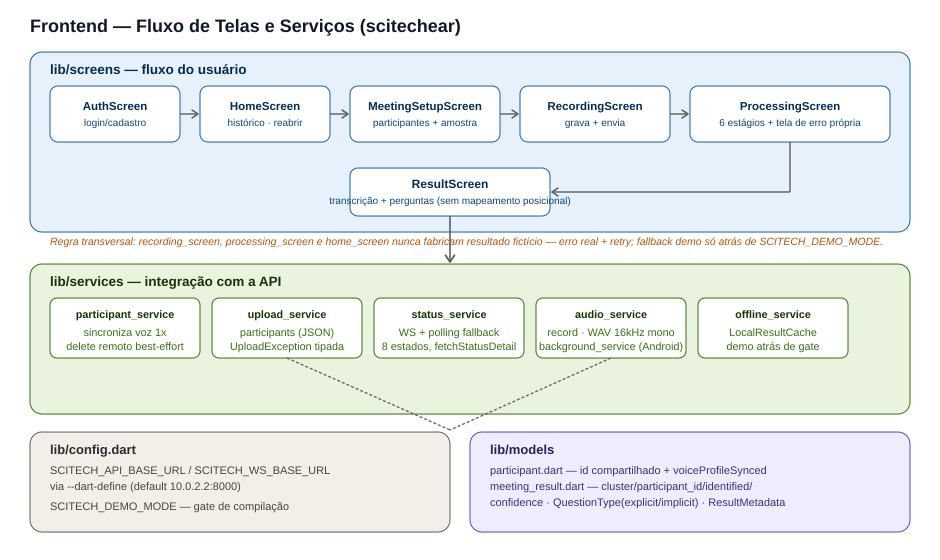

# SciTech Ear — Arquitetura do Frontend

> Complementa o [`docs/ARCHITECTURE.md`](./ARCHITECTURE.md) (visão geral do
> sistema). Este documento detalha só o repositório `scitechear` (app
> Flutter).

## Visão geral



O app é um **cliente fino**: capta áudio, envia ao backend, acompanha o
processamento e exibe o resultado. Nenhum modelo de IA roda no
dispositivo — toda a inteligência vem da API.

## Fluxo de telas (`lib/screens`)

| Tela | Papel | Serviços que aciona |
|---|---|---|
| `AuthScreen` | Login/cadastro (hoje simulado, sem backend de autenticação real). | `AuthService` |
| `HomeScreen` | Histórico de reuniões e ponto de partida para uma nova. Reabre reuniões salvas. | `AuthService`, `StatusService` |
| `MeetingSetupScreen` | Título da reunião e cadastro de participantes, incluindo a amostra de voz. | `ParticipantService` |
| `RecordingScreen` | Grava o áudio (WAV 16kHz mono) e envia ao final. | `AudioService`, `BackgroundService`, `UploadService` |
| `ProcessingScreen` | Acompanha os 6 estágios não-terminais do job; erro vira uma tela própria, não um resultado fabricado. | `StatusService` |
| `ResultScreen` | Exibe a transcrição (por falante) e as perguntas (explícitas/implícitas), em abas. | — |

**Regra transversal que vale para as três telas de fluxo de gravação/
histórico** (`RecordingScreen`, `ProcessingScreen`, `HomeScreen`): uma falha
real do backend nunca é convertida em resultado fabricado localmente. O
usuário vê o erro e pode tentar novamente ou voltar. O caminho de demonstração
(dados fictícios) só existe atrás da flag de build `SCITECH_DEMO_MODE`.

## Serviços (`lib/services`)

| Serviço | Responsabilidade | Ponto de atenção |
|---|---|---|
| `participant_service.dart` | Sincroniza a amostra de voz com o backend (`POST /participants/{id}/voice-samples`) e solicita exclusão remota ao apagar um participante. | A sincronização acontece **uma vez**, no cadastro/atualização — nunca a cada reunião. Só é chamada a partir de `participants_screen.dart`. |
| `upload_service.dart` | Envia o áudio e os participantes (`participants` como JSON com `id`/`name`) via multipart. | Não envia mais `voice_samples[]` a cada upload. Erros viram `UploadException` tipada, com mensagens acionáveis. |
| `status_service.dart` | Acompanha o job via WebSocket, com fallback automático para polling. | Trata o WS fechando cedo (antes de um estado terminal) como equivalente a erro, caindo no polling — evita travar a tela de processamento. |
| `audio_service.dart` + `background_service.dart` | Captura o áudio (pacote `record`) e mantém a gravação ativa em segundo plano no Android (foreground service). | — |
| `offline_service.dart` | `LocalResultCache` (reabrir reuniões já processadas) e o gerador de resultado demo. | O gerador de demo só é chamado atrás do gate `SCITECH_DEMO_MODE` — a política de "quando fabricar" fica nos pontos de chamada, não dentro da função. |

## Modelos (`lib/models`)

- **`participant.dart`** — `id` é a identidade compartilhada com o backend
  (`participant_id`); `voiceProfileSynced` indica se a amostra atual já foi
  sincronizada.
- **`meeting_result.dart`** — espelha o contrato canônico do backend:
  `TranscriptSegment` (`cluster`, `participant_id`, `identified`,
  `confidence`, com `speaker` agora nulável) e `Question`
  (`type: explicit|implicit`, `participant_id`/`speaker`/`time` nuláveis).
  Ver o contrato completo em
  [`docs/ARCHITECTURE.md`](./ARCHITECTURE.md#4-contrato-de-dados-canônico).

## Configuração (`lib/config.dart`)

A URL do backend não é mais fixa no código — é definida em tempo de build:

```bash
flutter run \
  --dart-define=SCITECH_API_BASE_URL=http://10.0.2.2:8000 \
  --dart-define=SCITECH_WS_BASE_URL=ws://10.0.2.2:8000
```

`10.0.2.2` é o endereço padrão do Android Emulator para alcançar o
`localhost` do computador host. Para dispositivo físico, use o IP local da
máquina que roda o backend.

O modo demo é outra flag de compilação, não um toggle em runtime — evita o
risco de ficar "esquecido ligado" quando o backend real volta a responder:

```bash
--dart-define=SCITECH_DEMO_MODE=true
```

## Regras que este repositório nunca viola

- **Sem mapeamento posicional de falante.** `ResultScreen` nunca associa
  `SPEAKER_N` a um participante pela ordem da lista — usa exclusivamente o
  `speaker`/`participant_id` que o backend resolveu por biometria.
- **Sem fallback fictício automático** nas telas de gravação, processamento
  e histórico.
- **`participant_id` como chave**, nunca o nome, para qualquer
  correlação com o backend.

## Escopo da V1

Android apenas (testado via Android Emulator e dispositivo físico). iOS é
preservado no código, mas não é critério de aceite desta fase.
